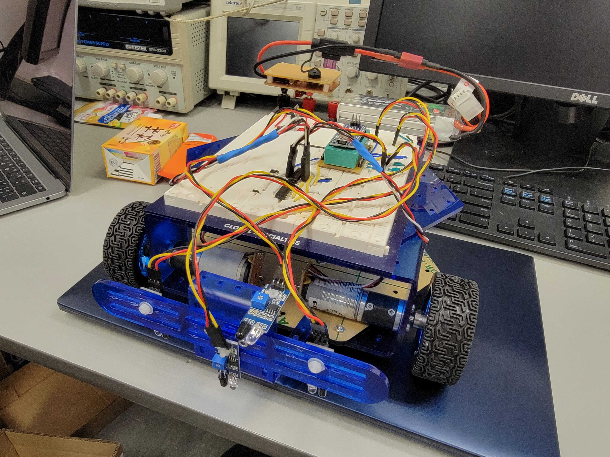
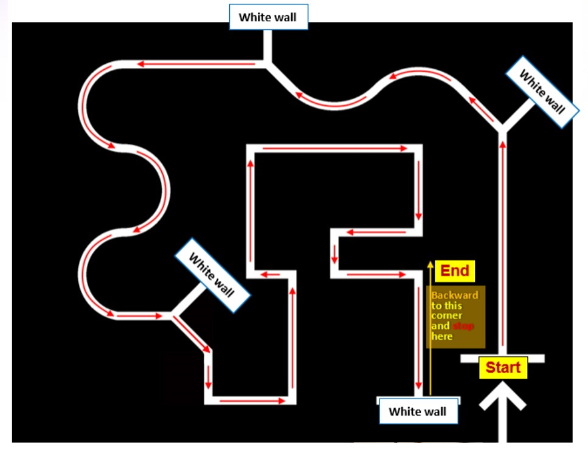

# line_following_car
In this project, I built an autonomous line-following car using basic IC components, motors, Arduino.  
 \
The car is equipped with 4 sensors, 1 facing forward, 3 facing downwards. 

The main goal of this project is for the vehicle to successfully finish the track map:  
 

Here is my logic flow chart for the project: \

This is the full track run-through of the car: 

https://user-images.githubusercontent.com/91371465/231346712-c7bee3e9-21a8-4c4f-9ff5-840bca2fdd03.mp4

